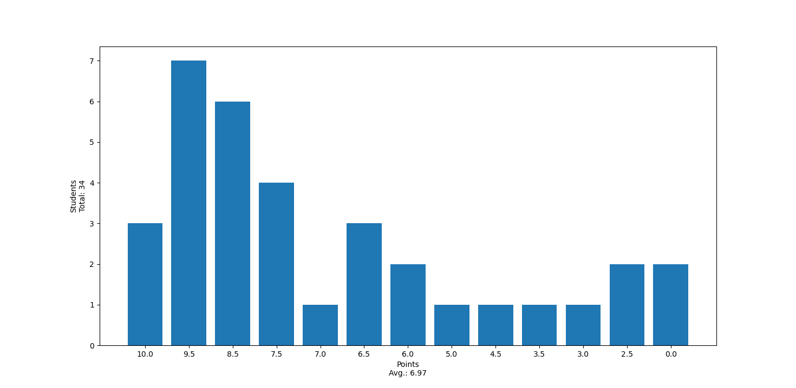

# Korrektur Exercise-01

## Häufige Fehler

### Aufgabe 1.1

Wer weiterhin Probleme bei der Installation hat, bitte nach dem Tutorat

### Aufgabe 1.2

- Terminierung war nicht erfüllt für $x,y=0$ aber nicht $x = y$
- Dadurch auch kein Algorithmus laut Definition der Vorlesung, gab keinen Abzug wenn man alle Bedingungen als erfüllt ansah

### Aufgabe 1.3

- Es ging vor allem um den Unterschied zwischen der Python-Shell und dem normalen ausführen von `.py` Dateien

### Aufgabe 1.4

- Achtet auf die genau Anforderung!!!

```sh
Python
Python
Python
```

heißt nicht

```sh

Python
Python
Python
```

oder

```sh

 Python
 Python
 Python
```

oder

```sh
Python 
Python 
Python

```

## Punkteverteilung

