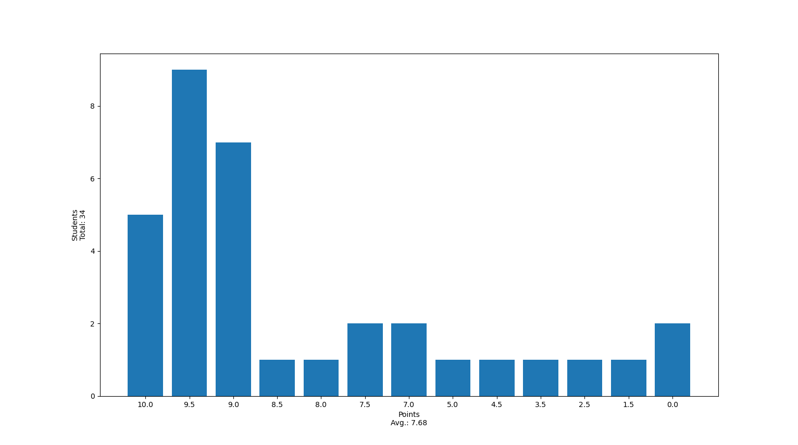
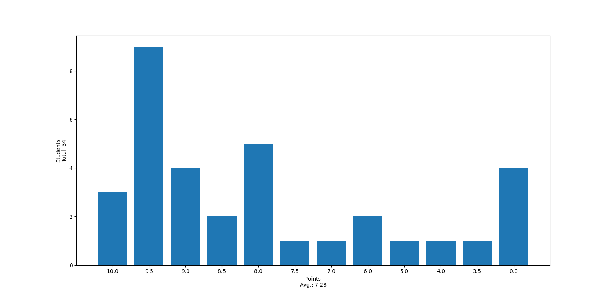

# Tutorium 04 - 10.11.2023

## [Exercise 02](https://proglang.informatik.uni-freiburg.de/teaching/info1/2023/exercise/sheet02.pdf) und [Exercise 03](https://proglang.informatik.uni-freiburg.de/teaching/info1/2023/exercise/sheet03.pdf)

### Punkteverteilung Exercise 02



### Punkteverteilung Exercise 03



### Häufige Fehler

- **Schaut genau was muss ausgegeben werden!!!**
- Achtet auf den Build-Output
        - **Linter-Error?** (-0.5 Punkte pro Datei)
        - **Syntax-Error?** (0 Punkte ab Exercise 4)
        - **Stunden eingetragen?** (-0.5 Punkte)
- lest euch die Aufgaben genau durch
- kommentiert keinen Quellcode aus, lasst ihn weg, oder lasst ihn stehen
- Testet euren Code mit `assert`
      - später lernen wir noch bessere Tests kennen
      - lasst eure `assert` nicht einfach in der Logik stehen!

#### Wrong

```py
def some_function(arg):
    assert arg <= 360
    return calculate(arg)
```

#### Right (*kind of*)

```py
def some_function(arg) -> float:
    return calculate(arg)

if __name__ == "__main__":
    assert some_function(0.69)  <= 42
    assert some_function(0.420) <= 1337
```

## Vorstellen/Vorrechnen

- mz242
- vb205

## [Exercise 04](https://proglang.informatik.uni-freiburg.de/teaching/info1/2023/exercise/sheet04.pdf)

- Abgabe Montag 9:00 im [Git](https://git.laurel.informatik.uni-freiburg.de/)
- Fragen?
