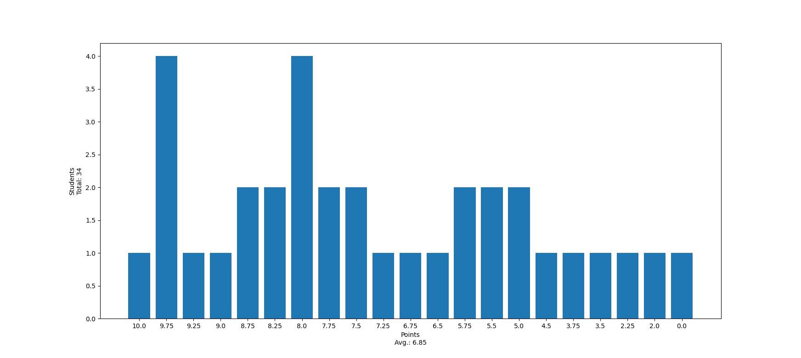

# Tutorium 05 - 17.11.2023

## Korrektur [Exercise-04](https://proglang.informatik.uni-freiburg.de/teaching/info1/2023/exercise/sheet04.pdf)

### Punkteverteilung



### Häufige Fehler

- Type Annotations
- Print-Statements, Top-Level Statements in Logik/nicht in

    ```python
    if __name__ == "__main__":
        assert # some test
    ```

- Ich kann euch prinzipiell immer 0 Punkte geben wenn Ihr etwas verwendet, was nicht Teil der Vorlesung war
- Lest die Aufgabenstellungen/Hinweise auf dem Blatt
- Benennt eure Dateien/Methoden richtig

## Vorrechnen

1. `lists.py`
    A. `even`:
    B. `min`:
    C. `max`:
2. `euler.py`
    A. `fac`:
    B. `approx_e`:
3. `binary.py`
    A. `to_num`:
    B. `stream_to_nums`:

## [Exercise-05](https://proglang.informatik.uni-freiburg.de/teaching/info1/2023/exercise/sheet05.pdf)

- Abgabe Montag 09:00 Uhr im [git](https://git.laurel.informatik.uni-freiburg.de/)
- Probleme beim installieren von `pygame`?

## Übungsaufgaben

### Annotations

#### [Primes](./src/primes.py)

Schreibe eine Funktion `prime_factorization` die eine Ganzzahl `n` entgegen nimmt und alle Primfaktoren berrechnet und die gegebene Zahl `n` in einen Paar mit den Primfaktoren als Liste zurückgibt. Denkt dabei an die richtigen Type Annotations

```python
def prime_factorization(n):
    pass
```

#### [Dataclass](./src/data_classes.py)


