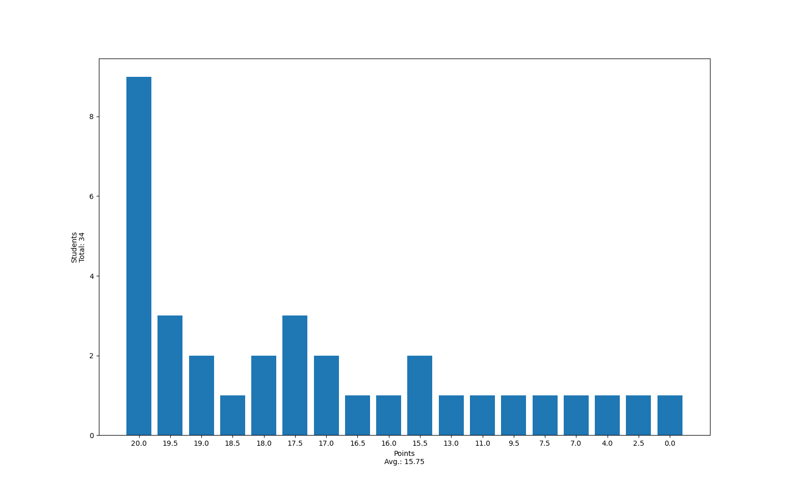

# Tutorium 06 - 24.11.2023

## Vorab Informationen

- Kollektiver [Discord](https://s.narl.io/s/discord-invite) mit Tutorium 05 (Daniel Mironow)
    - Dani's-Tutorium: Mi 16:00 - 18:00, Geb. 106, SR 00 007
    - Im Discord könnt ihr euch direkt mit uns Tutoren austauschen oder untereinander
- Invite: https://s.narl.io/s/discord-invite
- Es gibt wieder einen
    <details>
        <summary>QR-Code:</summary>
        
    </details>

## Korrektur Blatt 05

- am Samstag, ich hab mich etwas vertan bei der Korrektur
- Punkteverteilung und häufige Fehler werden hier hinzugefügt



### Häufige Fehler

- Type annotation
- `@dataclass` nicht benutzt
- mutieren von erstellten Objekt
- Call über Class und nicht über Objekt

## Vorrechnen

1. Python-Game
    1. `Vec2`: aw616
    2. `add_vecs`: fk439
    3. `Item`: ln200
    4. `Snake`: lp321
    5. `Game`: rl173
    6. `turn_direction`: ih205
    7. `grow_positions`:
    8. `collision`:
    9. `generate_item`:
    10. `pick_item`:

## Recap - Was ist neu?

### Union-Type und Type Definitionen

- neues `type` Keyword
- mit `|` lassen sich Union-Types definieren

```py
type Number = int | float | complex
```

---

### Generics (Typvariabeln)

Manchmal weiß man nicht welcher Typ genau gemeint ist, möchte aber trotzdem "sicherstellen" dass es sich nicht um zwei unterschiedliche handelt:

```py
def some_func[T](some_list: list[T]) -> T:
    # ...
```
kleines Beispiel von "Bounds" aus Rust:

```rust
fn some_func<T: Add>(some_list: Vec<T>) -> T {
    // ...
}

```

oder noch schöner

```rust
fn some_func<T>(some_list: Vec<T>) -> T
where T: Add<Output = T> + Default,
{
    // ...
}
```

```py
@dataclass
class Stack[T]:
    internal_list: list[T]

    def push(self, item: T) -> None:
        self.internal_list.append(item)

    def pop(self) -> T | None:
        if len(self.internal_list) == 0:
            return None
        return self.internal_list.pop()
```

```py
type Optional[T] = T | None
```
Python ist nicht statisch typisiert (statically-typed)! Bedeutet trotz annotation könnt ihr machen was ihr wollt:

```py
def add(x: int, y: int) -> int:
    return x + y

add(2, 2.0) # 4.0
```

genauso ist es bei Generics:

```py
from mylist import MyList

lst: MyList[int] = MyList()
lst.push_back(0)
lst.push_back(1)
print(lst) # [0, 1]
lst.push_back("haha not a number")
print(lst) # [0, 1, haha not a number]
```

---

### self

- mit `self` ruft man das Objekt wessen Verhalten man modelliert
    - damit kann das Objekt verändert (mutiert) werden
    - einfache Datenklassen bekommen Objekte die ein Verhalten modellieren
- jede Methode eines Objekt bekommt `self` als ersten Parameter und gibt vor wie sich ein Objekt verhält

```python
@dataclass
class MyNumber[T]():
    number: T

    def add(self, value: T) -> T:
        self.number += value
        return self.number

num = MyNumber(3)
print(num.add(5)) # 8
print(num.number) # 8
```

---

### Pattern-Matching

Mit dem `match` Keyword lassen sich verschiedene Bedingungen *matchen*

- Zunächst Types:
    - Wir erstellen die Datenklassen

        ```python
        @dataclass
        class Point1D[T]:
            x: T


        @dataclass
        class Point2D[T]:
            x: T
            y: T


        @dataclass
        class Point3D[T]:
            x: T
            y: T
            z: T
        ```
    - Wir erstellen einen Typ Alias `Point`
        ```py
        type Point[T] = Point1D[T] | Point2D[T] | Point3D[T]
        ```
    - Nun können wir den Type Alias mit Pattern-Matching auf den eigentlichen Datentypen reduzieren
        ```py
        def print_point[T](pt: Point[T]) -> None:
            match pt:
                case Point1D(x):
                    print(f"Point1D: ({x})")
                case Point2D(x, y):
                    print(f"Point2D: ({x}, {y})")
                case Point3D(x, y, z):
                    print(f"Point3D: ({x}, {y}, {z})")
                case _:
                    print("Not a point!")
        ```
- Aber auch Bedingungen wie Werte
    - Nun erweitern wir unsere `print_point` um Nullpunkte auszugeben
        ```py
        match pt:
            case Point1D(0) | Point2D(0, 0) | Point3D(0, 0, 0):
                print("Nullpunkt!")
            case Point1D(x):
                print(f"Point1D: ({x})")
            case Point2D(x, y):
                print(f"Point2D: ({x}, {y})")
            case Point3D(x, y, z):
                print(f"Point3D: ({x}, {y}, {z})")
            case _:
                print("Not a point!")
        ```
    - Achtung: Reihenfolge der Cases ist wichtig!
        ```py
        match pt:
            case Point1D(x):
                print(f"Point1D: ({x})")
            case Point2D(x, y):
                print(f"Point2D: ({x}, {y})")
            case Point3D(x, y, z):
                print(f"Point3D: ({x}, {y}, {z})")
            case Point1D(0) | Point2D(0, 0) | Point3D(0, 0, 0):
                print("Nullpunkt!")
            case _:
                print("Not a point!")
        ```
- Guards

    ```py
    match pt:
        case Point1D(x) if x == 0:
            print("1-D Nullpunkt!")
        case Point1D(x):
            print(f"Point1D: ({x})")
        case Point2D(x, y):
            print(f"Point2D: ({x}, {y})")
        case Point3D(x, y, z):
            print(f"Point3D: ({x}, {y}, {z})")
        case _:
            print("Not a point!")
    ```
- Noch mehr Types *matchen*!
    ```py
    match pt:
        case Point1D(int):
            print(f"Ganzzahliger Punkt! {pt.x}")
        case Point1D(float):
            print(f"Gleitkomma Punkt! {pt.x}")
        # ...
    ```
- Und es wird immer seltsamer

    ```py
    match some_list:
        case ["🤡", *other]:
            print(f"your list starts with 🤡 and the rest is {other}")
    ```
## Blatt 06

- Fragen?

## Aufgabe: eigene Liste implementieren

Implementiere eine generische Liste mit `append`, `get` und `remove`, ohne buildin Listen zu verwenden!

### Konzept einer (einfach verketteten) Liste

- Es gibt einen Listeneintrag `Element`, der den eigentlichen Wert des Eintrags `value` beinhaltet und einen Verweis auf das nächste Element `next` in der Liste
- Um dann einen Eintrag `x` zu finden muss man nur `x`-mal die Liste ablaufen und den Wert auslesen
- Wenn man ein Element hinzufügen will muss man lediglich ans Ende der Liste laufen und ein neuen Eintrag erstellen
- Wenn man ein Element entfernen will muss man lediglich das nächste Element vom vorherigen auf das nächste Element vom zu entfernenden setzen

### Hilfestellung

```py
@dataclass
class Element[T]:
    value: T
    next: 'Element[T] | None'

class MyList[T]:
    head: Element[T] | None
    length: int

    def append(self, value: T) -> None:
        pass

    def get(self, index: int) -> T | None:
        pass

    def remove(self, index: int) -> T | None:
        pass
```

