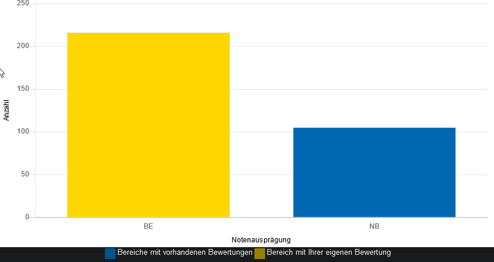
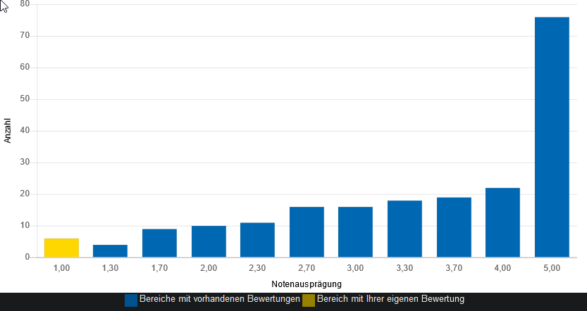

# Tutorium 07 - 01.12.2023

## Execrise 06

- Korrektur wieder am Samstag

### Problematik ChatGPT und Plagiate

- ChatGPT ist ein tolles Tool, warum?
    - Manchmal liefert es andere Lösungen zu Problemen
    - Grundverständnis bei neuen Problemen
    - integriert in die IDE (z.B. Github Copilot):
        - schneller Code schreiben
            <details>
            <summary>Wie viele Zeilen Code schreibt ein Entwickler durchschnittlich am Tag?</summary>
            <space><space><space><space>10 bis 50 Codezeilen
            </details>
        - Leichtsinnsfehler ausbessern
    - Kurz: Es nimmt einen repetetive Arbeit ab

#### Die Problematik?

- Ein EidP soll das Grundverständnis von Programmieren vermittelt werden
    - Denkweise
    - Konzepte in der theoretischen Informatik
    - Konzepte in Programmiersprachen
    - Übung
- Um ChatGPT sinnvoll zu nutzen müsst ihr diese Grundverständnis bereits besitzen
- Auch Studierende mit Vorwissen profitieren davon die Übung sinnvoll zu bearbeiten
    - Wenn Ihr für die Aufgaben ChatGPT verwendet, dann habt ihr nicht genug Vorwissen

<details>
<summary>Studienleistung WS2022</summary>

</details>
<details>
<summary>Notenverteilung WS2022</summary>

</details>


#### Also, macht eure Aufgaben selber!

---

## [Advent of Code](https://adventofcode.com/)

- Aktuell gibt es wie jedes Jahr wieder [Advent of Code](https://adventofcode.com/).
- Jeden Tag eine neue Aufgabe
- Von einfach bis unmenschlich schwer (tendenziell eher einfach)
- insane Storyline
- [Tag 1](https://adventofcode.com/2023/day/1) ist schon da!
- Auch sehr nice um neue Sprachen zu lernen
- Persönliche Empfehlungen:
    - [Rust](https://www.rust-lang.org/) - Multi-paradigm mit einzigartigen Konzepten
    - [Haskell](https://www.haskell.org/) - Funktionale Programmierung
    - [Go](https://go.dev/) - OOP, High-Level Programming, sehr einfach Projekte mit aufzusetzen!
    - [Zig](https://ziglang.org/) - Low-Level Programming, rein prozedural, C-Alternative

----

## Wichtiges/Hilfreiches für Exercise-07

### Rekursion

- Rekursion in Python sind Funktionen die sich selbst aufrufen
    ```python
    def fac(n: int) -> int:
        if n <= 1: # Abbruchbedingung, kein Rekursiver Aufruf mehr!
            return 1
        return n * fac(n - 1) # Rekursiver Aufruf
    ```
- Eine Rekursion braucht eine **Abbruchbedingung**
- primitive Rekursionen können auch einfach iterative gelöst werden
    ```python
    def fac2(n: int) -> int:
        fac = 1
        for i in range(1, n + 1):
            fac *= i
        return fac
    ```
- Eine Rekursion kann mehrere Rekursionspfade haben! (Kaskadenförmige Rekursion), welche auch primitiv berechenbar sind!
    ```python
    def fib(n: int) -> int:
        if n in {0, 1}: # Abbruchbedingung
            return n
        return fib(n - 1) + fib(n - 2) # mehrere Rekursionsaufrufe
    ```
- Wie Funktioniert das?
    -  Es wird ein Rekursionsbaum aufgebaut
    -  Wenn dieser Fertig ist wird berechnet
    -  Z.b. `fac`:
        ```
        fac(5) 
        5 * fac(4) 
        5 * 4 * fac(3) 
        5 * 4 * 3 * fac(2)
        5 * 4 * 3 * 2 * fac(1)
        5 * 4 * 3 * 2 * 1
        120
        ```

        ```
        fib(4)
        fib(3)                          + fib(2)
        (fib(2)             + fib(1))   + (fib(0) + fib(1))
        ((fib(0) + fib(1))  + fib(1))   + (fib(0) + fib(1))
        ((0 + 1)            + 1)        + (0 + 1)
        3
        ```
- Gibt es Rekursionen die nicht iterative berechenbar sind?
    - $\mu$-Rekursionen oder partiell Rekursionen
    - erste partiell rekursive Funktion von Wilhelm Ackermann 1926, die "Ackermannfunktion"
       
        $\alpha(0, m) = m + 1$ \
        $\alpha(n, 0) = \alpha(n - 1, 1)$ \
        $\alpha(n, m) = \alpha(n, \alpha(n, m - 1))$

        ```python
        def ack(n: int, m: int) -> int:
            match (n, m):
                case (0, _):
                    return m + 1
                case (_, 0):
                    return ack(n - 1, 1)
                case _:
                    return ack(n - 1, ack(n, m - 1))
        ```

#### Tipp:

Man kann alles rekursiv Aufbauen mit Operatoren (`+, -, *, /, %, //, &&, and, ...`), also auch Listen oder Strings

```python
def all_fac(max: int) -> list[(int, int)]:
    if max == 0: # Abbruchbedingung
        return [(0, 1)]
    return [(max, fac(max))] + all_fac(max - 1) # Rekursion

def all_fac_str(min: int, max: int) -> str:
    if min >= max: # Abbruchbedingung
        return f"{fac(min)}"
    return f"{fac(min)} "  + all_fac_str(min + 1, max) # Rekursion

def fib_str(n: int) -> str:
    if n in {0, 1}: # Abbruchbedingung
        return str(n)
    return f"({fib_str(n - 1)} + {fib_str(n - 2)})" # Rekursion
```

---

### Rekursion in Bäumen

- Drei möglichkeiten einen Baum *abzulaufen*
    - **Pre-Order**: Knoten, links, rechts
        ```python
        def preorder[T](tree: BTree[T]):
            match tree:
                case Node(value, left, right):
                    print(value)
                    preorder(left)
                    preorder(right)
                case _:
                    return
        ```
    - **Post-Order**: links, rechts, Knoten
        ```python
        def postorder[T](tree: BTree[T]):
            match tree:
                case Node(value, left, right):
                    postorder(left)
                    postorder(right)
                    print(value)
                case _:
                    return
        ```
    - **In-Order**: links, Knoten, rechts
        ```python
        def inorder[T](tree: BTree[T]):
            match tree:
                case Node(value, left, right):
                    inorder(left)
                    print(value)
                    inorder(right)
                case _:
                    return
        ```

---

## Fragen?