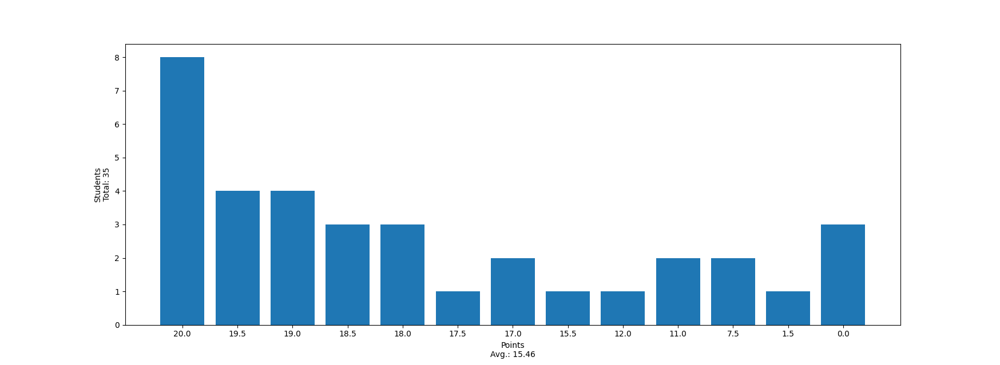

# Tutorium 09

Korrektur 08 - Vererbung, OOP, Datenkapselung

---

# Korrektur 08

---

# Punkteverteilung



---

# Häufige Fehler

* `@dataclass` nicht verwendet
* `__init__` überschrieben, obwohl `@dataclass` das macht und dann `super().__init__()` vergessen
* Kein Polymorphismus verwendet, also Code Duplikate oder auf `self` gematched/`isinstance()` verwendet
* Code nicht getestet, Datei nicht ausführbar => **0 Punkte**!

---

# Musterlösung - Aufgabe 8 a,b)

```py
import math
from dataclasses import dataclass


@dataclass
class Vec2:
    x: float
    y: float

    def abs(self) -> float:
        return math.sqrt(self.x * self.x + self.y * self.y)
```

---

# Musterlösung - Aufgabe 8 c)

```py
@dataclass
class GameObject:
    position: Vec2
    radius: int
    alive: bool
    color: tuple[int, int, int]

@dataclass
class Projectile(GameObject):
    speed: float

@dataclass
class StaticObject(GameObject):
    rotation: float
```

---

# Musterlösung - Aufgabe 8 c)

```py
class Item(StaticObject):
    amount: int

class Ammunition(Item):
    pass

class Health(Item):
    pass

class Ship(GameObject):
    shots: int
    hp: int

class Asteroid(StaticObject):
    special: bool
```

---

# Musterlösung - Aufgabe 8 d)

```python
class GameObject:

    # ...

    def update(self, width: int, height: int, delta: float):
        if not (0 <= self.position.x < width and 0 <= self.position.y < height):
            self.alive = False

class Projectile(GameObject):
    speed: float

    def update(self, width: int, height: int, delta: float):
        self.position.y -= delta * self.speed
        super().update(width, height, delta)
```

---

# Musterlösung - Aufgabe 8 d)

```python
class StaticObject(GameObject):
    rotation: float

    def update(self, width: int, height: int, delta: float):
        self.position.y += delta
        self.rotation += delta / self.radius
        super().update(width, height, delta)

class Ship(GameObject):
    shots: int
    hp: int

    def update(self, width: int, height: int, delta: float):
        if self.hp <= 0:
            self.hp = 0
            self.alive = False
        super().update(width, height, delta)
```

---

# Musterlösung - Aufgabe 8 e)

```python
@dataclass
class GameObject:

    # ...

    def is_colliding(self, other: "GameObject") -> bool:
        dist = Vec2(self.position.x - other.position.x, self.position.y - other.position.y)
        return dist.abs() <= self.radius + other.radius
```

---

# Musterlösung - Aufgabe 8 f)

```python
class GameObject:

    # ...

    def on_collision(self, other: "GameObject"):
        pass

class Projectile(GameObject):

    # ...

    def on_collision(self, other: 'GameObject'):
        if not isinstance(other, Ship):
            self.alive = False
```

---

# Musterlösung - Aufgabe 8 f)

```python
class StaticObject(GameObject):

    # ...

    def on_collision(self, other: 'GameObject'):
        self.alive = False

class Ship(GameObject):
    # ...
    def on_collision(self, other: 'GameObject'):
        match other:
            case Asteroid():
                self.hp -= other.radius
            case Health():
                self.hp += other.amount
            case Ammunition():
                self.shots += other.amount
```

---

# Musterlösung - Aufgabe 8 f)

```python

@dataclass
class Asteroid(StaticObject):
    special: bool

    def on_collision(self, other: 'GameObject'):
        if not isinstance(other, Asteroid):
            self.alive = False

```

---

# Musterlösung - Aufgabe 8 g)

```python
@dataclass
class Ship(GameObject):

    # ...

    def shoot(self) -> Projectile:
        alive = False
        if self.shots:
            self.shots -= 1
            alive = True
        pos = Vec2(self.position.x, self.position.y)
        return Projectile(pos, 5, alive, (255, 0, 0), 3)
```

---

# Musterlösung - Aufgabe 8 h)

```python
@dataclass
class GameObject:

    # ...

    def draw(self, screen: pygame.Surface):
        pygame.draw.circle(screen, self.color, (self.position.x, self.position.y), self.radius)
```

---

# Override-Dekorator

- ist in `typing`
- Wird über Methoden geschrieben, die überschrieben werden
- Pylance zeigt einen Fehler an, wenn die überschriebene Methode in keiner Oberklasse gefunden wird
- Hilft Fehler vorzubeugen - falsche Signatur, Parameter, ...

---

# Override-Dekorator - Beispiel
```python
from typing import override
from dataclasses import dataclass


@dataclass
class GameObject:

    def on_collision(self, other: 'GameObject'):
        pass

class StaticObject(GameObject):

    @override
    def on_collisoin(self, other: 'GameObject'): # Pylance-Error
        self.alive = False
```
---

# Override-Dekorator - Beispiel
```python
from typing import override
from dataclasses import dataclass


@dataclass
class GameObject:

    def on_collision(self, other: 'GameObject'):
        pass

class StaticObject(GameObject):

    @override
    def on_collision(self): # Pylance-Error
        self.alive = False
```

---

# Datenkapselung

- Man möchte manche Implementierung verstecken
- Wenn andere deinen Code verwenden, dann möchte man eine Schnittstelle anbieten die intuitiv ist.

```python
@dataclass
class MyList[T]:
    internal_list: list[T] = []

    def add(self, item: T) -> None:
        self.internal_list += [other]
```
---
# Datenkapselung - warum ist das schlecht?

```python
from my_collections import MyList

xs = MyList()
xs.internal_list # ????
```

- was sollen wir mit `internal_list`?
- andere sollten nur auf `add()` zugreifen können

---

# Private Attribute

```python
@dataclass
class MyList[T]:
    internal_list: InitVar[list[T]]
    length: InitVar[int]

    def __init__(self):
        self.__internal_list = []
        self.__length = 0

    def add(self, item: T):
        self.__internal_list += [item]
        self.__length += 1

    @property
    def length(self) -> int:
        return self.__length
```

---

# Private Attribute

```python
@dataclass
class MyList[T]:
    internal_list: InitVar[list[T]]
    length: InitVar[int]

    def __init__(self):
        self.__internal_list = []
        self.__length = 0
```

---

# Private Attribute

```python
@dataclass
class MyList[T]:
    internal_list: InitVar[list[T]]
    length: InitVar[int]

    def __init__(self):
        self.__internal_list = []
        self.__length = 0

    def add(self, item: T):
        self.__internal_list += [item]
        self.__length += 1

    @property
    def length(self) -> int:
        return self.__length
```
---

# Private Attribute - Setter

- Manchmal wollen wir trotzdem private Attribute setzen
- Aber vielleicht nur wenn bestimmte Bedingungen erfüllt sind

```python
class GameObject:
    position: InitVar[tuple[int, int]]

    def __post__init__(self, position: tuple[int, int]):
        assert (0, 0) <= position
        self.__position = position

    @property
    def position(self) -> tuple[int, int]:
        return self.__position
```

---

# Private Attribute - Setter

```python
@dataclass
class GameObject:
    position: InitVar[tuple[int, int]]

    def __post_init__(self, position: tuple[int, int]):
        assert (0, 0) > position
        self.__position = position

    @property
    def position(self) -> tuple[int, int]:
        return self.__position

    @position.setter
    def position(self, position: tuple[int, int]):
        if (0, 0) > position:
            return
        self.__position = position
```

---

# Comprehensive-Guide to `class`

## `@dataclass`

- Attribute werden im Klassenrumpf definiert
  - können mit einem Standardwert definiert werden
- `__init__`, `__post_init__`, `__repr__`, `__eq__`, `__lt__`, `__le__`, `__gt__`, `__ge__`, ... werden automatisch generiert
- In der Vorlesung benutzen wir nur `dataclass`

---

# Comprehensive-Guide to `class`

## `@dataclass`

- Attribute die im Klassenrumpf definiert werden, werden automatisch in die `__init__` generiert, auch wenn es einen Standardwert gibt!

```python
@dataclass
class A:
    x: int
    y: int = 0

    def __init__(self, x: int, y: int = 0): # das macht @dataclass von selber!
        self.x = x
        self.y = y
```
---

# Comprehensive-Guide to `class`

## `Enum`

- Wenn man eine endliche Aufzählung braucht (endliche Menge)
- macht die Fallunterscheidung einfach weil es endliche Elemente gibt
- Versichert auch dass kein quatsch übergeben wird wie zb bei `str`
- **niemals** mit `@dataclass`, sonst geht alles kaputt

---

# Enum - Beispiel

```python
def eval[T: (int | float)](operator: str, x: T, y: T) -> T:
    match operator:
        case '+':
            return x + y
        case '-':
            return x - y
        case '*':
            return x * y
        case '/' if y != 0:
            return x / y
        case _:
            return 0
```

---

# Enum - Beispiel

```python
from enum import Enum, auto

class Op(Enum):
    ADD = auto()
    SUB = auto()
    DIV = auto()
    MUL = auto()
```
Jetzt passen wir die Methodensignatur an
```python
def eval[T: (int | float)](operator: Op, x: T, y: T) -> T:
```
Jetzt kann nichts beliebiges als `operator` übergeben werden

---

# Blatt 09 - Fragen?

- Abgabe: 18.12. - 09:00
- Testet euren Code!
- Es gibt keine dummen Fragen wenns ums Verständnis geht